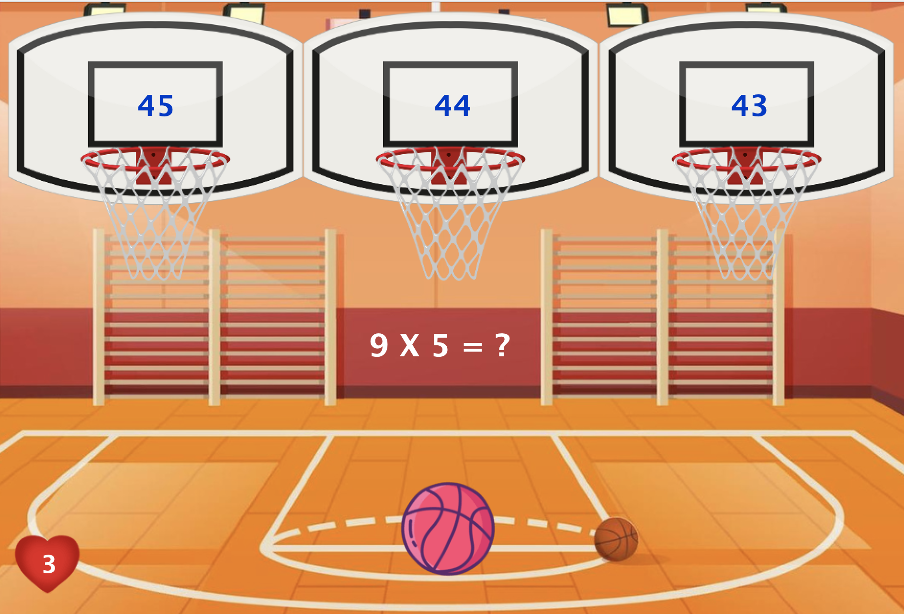

# Math Madness 

This game was developed as part of CS2212 at Western University - Winter 2023-24 by: Atmiya Patel, Ben Santhosh, Hoyeon Luke Jang, Minh Duc Pham, Tony Baocheng Li

Dive into the fun and learning with our educational basketball game designed for elementary students! Imagine combining the excitement of basketball with the challenge of math, where each level brings you five engaging math problems to solve. Players are tasked with aiming and shooting a basketball at the right answer, choosing from three multiple-choice options, each represented by a basketball hoop. But here's the twist: you are totally in control of how many you get right! The ball moves from left to right using your arrow key, adding a dash of thrill and testing your timing skills and your math knowledge. 

As players progress through the game, they journey through five levels for each level crafted to solidify their mathematical understanding while keeping the entertainment alive. The math puzzles get more intriguing as the player moves up in levels, ensuring the brain gets a good workout. We have also made it so that the student can always play it with a guarantee of no repetitive questions, and as many times as they want. Developed using Java and Java Swings, this game is a perfect blend of education and entertainment, tailored to strengthen the foundation of math in a playful, interactive environment. So, lace-up for some basketball action and get ready to shoot some hoops and numbers!

## Required Libraries

For Math Madness, you are required to have Java 19 and above with Java Swings library. 
Since Java Swing is automatically implemented in Java 19, there are no external library to download.

## Building(Compiling Math Madness)

1. Download the file and launch the program in the preferred IDE.
2. Then run PlayGame.java

OR

1. Locate the downloaded file in the terminal
2. Type javac PlayGame.java
3. Type java PlayGame

You should be good to play!

## Playing our game and Credentials for Instructor and Debuggers

For Student
1. Create an account using "Create a new account" using the button below login
2. Once you've created an account log in
3. Press instruction to access tutorials regarding the gameplay
4. Press "New game" button to start a new journey or press "Load game" button to load previous progress
5. The levels are divided into 4 modes: Addition, Subtraction, Multiplication, Division. Select your level and play!
6. You can check your ranking in the high scores tab in main menu.

For Instructors
1. Press Instructor mode button and enter password "IamAnInstructor"
2. Enter a student's username you want to access 
3. see their metrics!

For Debugger 
1. Press Debugger mode and enter password "IAmADebugger"
2. Now all your levels are unlocked!
